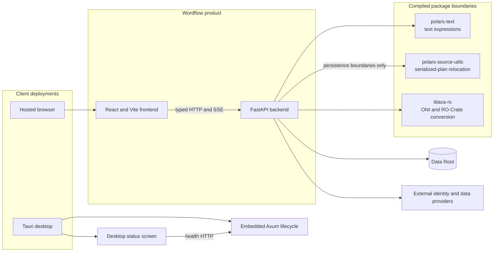

# System Overview

LDaCA Wordflow is a text-analysis application distributed as a hosted web app,
a packaged desktop app, and a Python package that can serve the bundled SPA.

## Projects

- `frontend/` contains the React/Vite application and Tauri desktop shell.
- `backend-rs/` contains the native Axum runtime, DuckDB project API, and server binary.
- `backend/` contains the FastAPI service published as `ldaca-wordflow`.
- `polars-text/` contains the Polars/PyO3 adapter for shared native text functions.
- `polars-source-utils/` contains Rust/PyO3 serialized-plan path utilities.
- `ldaca-rs/` contains shared text algorithms, model inference, ONI access and Arrow-based RO-Crate conversion.

The backend is tracked directly in this repository, which owns its CI and
`ldaca-wordflow` release workflow. The two Polars package roots remain Git
submodules. `ldaca-rs` is tracked directly in the root repository; shared
submodule registration waits for its initial commit to be published. Each package
has its own manifest and release workflow. The root project
coordinates local source resolution, frontend packaging, desktop builds, and
version stamping.

## Runtime Flow

1. The React client selects a Workspace and addresses backend resources by ID.
2. The backend snapshots User Files into Source Data Blocks and persists the
   Workspace graph.
3. Tabs and Analyses persist as portable Workspace-owned resources; remote
   collection downloads persist independently as user-owned User File Imports.
4. Private schedulers select queued work fairly, and fresh worker processes
   receive immutable Analysis inputs and write bounded Artifacts.
5. Analysis completion may publish Derived Data Blocks through the Workspace
   mutation boundary.
6. The unified SSE stream carries revisioned resource refresh and live Progress
   events; clients refetch authoritative REST resources.

In a hosted deployment, FastAPI normally serves the full SPA on the same site.
Desktop now embeds Axum in Tauri and mounts a separate lifecycle status screen.
It does not use Data Roots, Workspaces, or User File management. The Rust server
binary exposes the same [project runtime](backend/native-projects.md); it does
not yet replace the full Python server. See [desktop architecture](frontend/desktop.md).

## Dependency Direction

The backend owns product state and HTTP contracts. The frontend consumes the
exported OpenAPI schema. `polars-text` adapts the shared `ldaca-rs` computation primitives, while
`polars-source-utils` is used only at explicit serialized-plan persistence and
relocation boundaries. `ldaca-rs` owns portal protocol and conversion;
Wordflow owns credentials, import lifecycle and storage publication.
