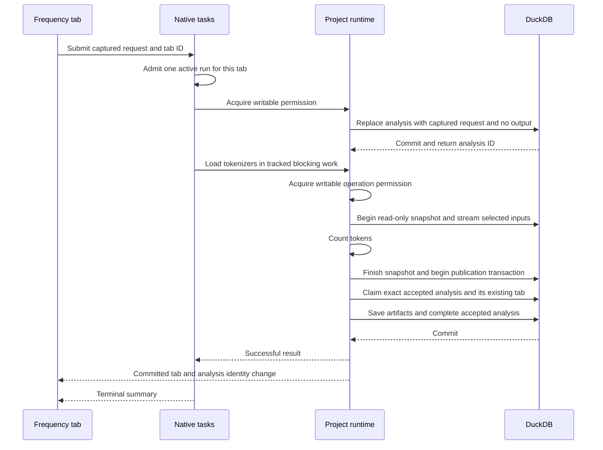

# Native analyses

Frequency, Concordance, Quotation and the five Plots modes run inside the owning `ProjectRuntime` and save each tab’s latest successful
result in the `.wfpj` database. It reuses native task ownership and independent
DuckDB operation connections. Other analysis tools remain unavailable; their
archived implementations are reference material, not active services.

[Project semantics](../../domain/native-projects.md#metadata-and-results) defines
what users keep. This page owns execution, artifact lifetime and publication.
The [native API reference](../../reference/native-project-api.md) owns route
contracts, and the [frontend overview](../frontend/overview.md#frequency) owns
draft and presentation state.

## Tabs, results and artifacts

Three durable records have distinct responsibilities:

| Record | Owns |
| --- | --- |
| `wordflow.tabs` | Stable identity, kind, name, position and display settings |
| `wordflow.analyses` | Unique owning tab, accepted request, creation time and optional versioned completed output |
| `wordflow.artifacts` | Named outputs owned by one analysis, with `storage_kind`, optional `relation_name`, BLOB content and applicable media type |

There is no stored tab-to-analysis pointer. The child ownership key is unique.
Private artifact Tables and Views have generated names in `wordflow` and remain
absent from both graph modes. `storage_kind='relation'` references a Table or View;
`'blob'` stores bytes with a media type. Typed relations retain exact integer and
floating-point values; result JSON stores small descriptors. Extension annotations
live only in qualified `wordflow.arrow_metadata` rows, independently copied onto
each retained relation. Saved reads never consult current source annotations.

Frequency creates and reads tabular artifacts. The schema and shared transactional
cleanup also support BLOB ownership; a future binary-producing analysis will
write and read its bytes within the same publication and read boundaries. `project/analyses.rs` owns kind-scoped tabs, generic result manifests and a shared
publication transaction accepting analysis-produced descriptors/artifacts.
`project/frequency.rs` owns Frequency's request, version decoder, calculations
and projections. Tab numbering and ordering are scoped by kind; Frequency, Concordance and Quotation can currently be created or run.
There is no dynamic analysis registry, general artifact SQL endpoint, filesystem
manifest or per-result directory. Save As copies results with the rest of the
database.

Source descriptions record the inputs used by a successful run. They do not
create live SQL dependencies, source freshness flags or a revision history.
Frequency persists full count Tables and a comparison View over those counts,
but no permanent source document copy. Results remain readable after their
sources change or disappear.

Future functions that publish selected original rows must retain those rows
with their result. Saved row positions must never be applied to a freshly read
source. A Data Block explicitly published from a result must own its data
independently, so deleting the analysis cannot remove or break it.

## Execution ownership

The HTTP caller captures the ordered sources, document columns and tokenizer
models. An accepted task is associated with its tab. The task collection admits
only one active run for that tab atomically, without a second busy flag or
persisted execution state. Other tabs and projects may overlap.

Before preparation, `begin_analysis_run` claims the existing tab and validates
its kind, deletes the previous analysis and owned artifacts/annotations, inserts a
new analysis UUID with the captured request and no output, and commits. That ID
travels through preparation and calculation. Run and Rerun share this path.
Cleanup reads ownership records and the catalogue without decoding result JSON or
evaluating broken Views. It drops owned Views before Tables and tolerates missing
relations. It never sweeps unrelated private relations or published Data Blocks.
Duplicate admission, editor conflicts and initial-transaction failure preserve
existing state. Later failure or cancellation leaves the accepted request without
output. Settings updates cannot overwrite requests because they update a different
record.

Tokenizer preparation uses `TaskContext::run_blocking` without holding a database
connection. The database stage then acquires the ordinary writable operation
permission and rechecks editor protection. A pending or active table editor
rejects that write boundary; analysis has no privileged bypass.

One read-only transaction reads both corpora from the same snapshot and streams
Arrow batches through the native `ldaca-rs` tokenizer/counting code. Native counts
remain in the operation's memory. After finishing the
input snapshot, a short write transaction claims the existing tab and publishes
the result. Both transactions belong to one runtime-owned operation: its
connection and lifecycle/editor leases remain held through computation and
cleanup. Ordinary independent transactions can overlap; editor startup and Save
As wait for that operation. No temporary corpus-file subsystem or global analysis
queue is involved.

Cancellation checks occur between documents, batches and stages. DuckDB work also
registers its connection-specific interrupt handle. A synchronous model load or
individual tokenization call can finish before cancellation settles; no worker
thread is force-terminated. The runtime retains accepted work after HTTP
disconnection or panel unmounting. Failure, cancellation and panic drop the
uncommitted operation connection before reporting completion. Cancellation after
a successful commit cannot turn that result into a failure.

Progress reports stages rather than invented percentages. Task summaries contain
the tab association, not refresh effects, result tables or model credentials. The existing in-memory retention and Close/Quit ownership apply.
Reload reconnects to active tasks; reopening a project restores successful results
without recovery or resumption of interrupted work.

## Atomic publication and deletion

Publication starts a fresh transaction after the source snapshot. It claims the
existing tab with reversible writes (DuckDB may elide a no-op update), then verifies
the exact accepted analysis ID, owning tab, kind and absent output. Missing,
replaced or already-completed analyses fail before any artifact creation.
Publication creates outputs and annotations and sets the result/version/completion
time together. Appender flush errors are checked before commit. Conflicts surface
without retries. Cancellation after commit does not undo success.

Schema version 1 retains primary-key, uniqueness and storage-shape checks without
ownership foreign keys. DuckDB can reject parent deletion after deleting referenced
children in the same transaction; centralized ownership keeps replacement atomic.
No journal, background collector or persisted task state repairs partial work.

Deleting a tab removes its analysis and outputs and requests task cancellation.
A racing publisher either commits before deletion or rolls back. Clear removes
artifacts and annotations and nulls the output fields while retaining the analysis
ID and request. Repeated Clear is harmless; active work blocks it. Task dismissal
is independent. Artifact readers validate ownership and read descriptors and
relations within the same snapshot. An existing analysis without output remains
readable, while output-specific operations return `result_unavailable`.

## Frequency projections and export

Frequency artifacts contain the complete vocabulary. Counts use unsigned 64-bit
columns; comparison measures preserve native floating-point NaN and infinity.
Empty results have explicit schemas. As in the native statistics library, two
empty corpora give an empty comparison, one empty corpus fails, and combined
totals must fit `u64`; no partial-success result is fabricated.

All three output contracts start at payload version 1 in schema version 1.
Their comparison artifact is a persisted SQL View containing all statistics,
including Overuse and Signed LL. The definition embeds the captured corpus totals
and references only its result's private count Tables. It never rereads live
corpora. DuckDB stores the definition at publication; application updates do not
regenerate it when opening or querying an existing result. There is no legacy output adapter.

`backend/src/project/frequency_statistics.sql` owns the application's SQL
calculation. The independent native `ldaca-rs` statistics API remains available
to its other consumers and provides a parity oracle in backend tests, including
zero counts, unequal totals, large unsigned counts and non-finite results. There
is no runtime switch between calculation engines or vocabulary cache. The
[benchmark record](../../releases/2026-09-19-frequency-statistics-view.md) records
the measured cost and reproduction command.

Projection requests identify an immutable result and concrete Frequency options.
DuckDB applies stopwords, wildcard filters and sorting before the requested page
or chart limit. Corpus ranks are assigned after stopword exclusion and before wildcard filtering. Ordinary match totals are independent of display limits; exports retain their existing columns. Stopwords do not recalculate corpus totals or other token
statistics. Equal counts use token order as a deterministic tie-breaker.
Overuse and Signed LL are columns of the saved View and are sortable and exportable. Juxtorpus requires
more than ten combined occurrences and takes both ends of its weighted LogRatio
ranking, retaining neutral words and deduplicating overlap. The %DIFF and ELL
calculations remain unchanged.
`project/stopwords.rs` owns normalized word membership for editor reads, membership
changes, Frequency projections and exports. Live bubble actions submit small membership deltas; the backend applies DuckDB normalization and the word limit atomically. Unsubmitted text remains local on failure. Optional sorting stages complete rows and reinserts them into the existing Table in normalized word order within that same transaction. Constraints, defaults, registration and metadata are retained; any failure rolls back the whole operation. Preparation resolves a selected Table or
creates a registered copy of a View column with captured logical parents.

The client supplies `stopword_source: {source: {schema, name}, column}`. The backend
resolves the column and materializes its normalized words once into a
connection-local temporary relation inside the read transaction. It uses DuckDB's
text representation, trims whitespace, ignores NULL/blank values and deduplicates
case-insensitively in first occurrence order. More than 100,000 words is an error.
Projection count and page queries reuse that relation, including for volatile or
external Views. These sources remain ordinary project Tables/Views, outside
analysis artifact ownership. Count queries omit final display ordering; Juxtorpus
retains the ordering and limits that define its selected membership.
Tabs save the source reference and filtering toggle only. See the
[shared stopword ownership](../frontend/overview.md#shared-stopword-data-blocks)
for editing, invalidation and reference reconciliation.

Table exports include all matching rows rather than the currently displayed page,
with saved corpus names in the Reference/Study column headers.
Native exports reuse destination-adjacent staging, synchronization and final
installation. Browser downloads use the same saved result. CSV/Markdown exports
read the selected stopword source when Export runs. Bundles produce their table
and optional stopword text from the same transaction-local relation and return
both as multipart parts. Chart exports capture the displayed SVG and its matching
word set before preparing image/archive bytes.
Accepted export failures retain the task observer as their notification owner.

The storage foundation supports future nested document tables, retained source
rows, binary model/projection context and mutation completion records. It does
not restore those tools or require them to share Frequency's calculation logic.

## Concordance Preview and saved results

`project/concordance.rs` owns the concrete matcher adapter, page capture and
Run calculation. `project/concordance/queries.rs` owns typed saved queries,
density and publication. Both Preview and Run use the same native
`ldaca-rs` document matcher; token matching preserves original character offsets.

Preview prepares its matcher before obtaining a connection. A read-only
transaction captures one document page and one lookahead row; matching visits
only that page. Metadata sorting happens before pagination and can require a
larger database sort. Preview does not count the entire source, create result
records or enter task history. A caller-owned cancellation guard cancels the
operation when its request disappears; the owned operation retains lifecycle
permission until cleanup. Presentation changes reuse the returned Arrow page.
The frontend keeps submitted Preview settings only for the current tab visit.
Leaving the tab discards settings and pages; reopening does not calculate a Preview.
Only Run saves its request, through the shared initial transaction described above.

Run prepares tokenizers outside the database permission, then captures both
inputs into connection-local temporary Tables in one read-only transaction.
Batches contain at most 256 documents. Matching appends scalar match fields to
temporary storage with explicit flush checks and cancellation between documents
and stages. After the snapshot finishes, the existing fresh publication
transaction claims the still-existing tab and publishes its complete result.
Failure or cancellation after the initial Run transition leaves no result; a deleted tab cannot be
recreated by publication.

Each source owns three private relations:

- A documents Table retains each matching original row once, its DuckDB types,
  applicable Arrow metadata and a result-local document ID.
- A matches Table retains document IDs, occurrence order, contexts, matched text,
  Unicode character offsets, L1/R1 and extraction.
- A projection View joins those owned Tables and derives whole-result L1/R1
  frequencies before display filters.

Source fields live inside a separate struct, so generated field names cannot
overwrite original columns. Identical document text remains separate through
document IDs. No saved relation references the current source. JSON stores the
versioned `ConcordanceResultV1` descriptor and summaries, not retained rows.

Saved queries filter before counting, sorting and pagination. Density aggregates
the complete saved source, independently of the visible page. Document inspection
can request all retained matches for a document ID. Native offsets count Unicode
characters; the frontend converts text to code points before highlighting.

Add to Project is an ordinary native task. A single transaction creates every
selected output Table, its registration and applicable metadata. Match mode emits
one row per occurrence. Document mode emits one retained row per qualifying
document with `CONC_extraction` assembled from surviving extracts. Captured
sources still registered become logical parents; missing sources are neither
required nor recreated. Name or column collisions abort the entire publication.
Published Tables own their rows independently of analysis cleanup.

## Quotation Preview and saved results

`project/quotation.rs` owns the built-in English extractor adapter, saved queries
and publication. It reuses Concordance's document execution shape through
`project/document_matches.rs`: catalogue resolution, typed source capture,
bounded document reads, semantic metadata and Arrow page serialization. Each
analysis keeps its own native matcher and concrete result contract.

Preview validates the tab and input before preparing the pinned UDPipe model,
then captures a source page plus one lookahead row in a read-only transaction.
Only the requested documents are extracted. Zero quotes yield no displayed row;
multiple quotes remain nested in their original document. Preview has request
cancellation and no persistent result or task record. Context clipping and field
visibility are frontend presentation changes, not extraction requests.

Run uses the same extractor in 256-document batches and the existing task,
editor and publication boundaries. `QuotationResultV1` owns a matching-documents
Table, a scalar-quotes Table and their joined projection View. Original rows
remain typed inside `source`; generated fields cannot collide with metadata.
Saved document queries group all quotations for each retained document. Match
queries page individual quotations. Both support stable metadata ordering; match
queries additionally support generated-field sorting. Character offsets always
refer to the original Unicode text.

Publication creates an independent registered Table: either one row per quote
with selected `QUOTE_*` fields, or one row per matching document with required
`QUOTE_extraction`. It preserves selected source metadata, records a logical
parent only if the source is still registered, and rejects name/column collisions
atomically. Source deletion, result replacement and Clear results cannot remove
published rows. No remote-engine service, persistent Preview data or format change is
introduced. The [quotation runtime reference](../../reference/quotation-runtime.md)
owns model provisioning and software notices.

## Native Plots

`project/plots.rs` implements Trends, Compare, Scatter, Heatmap and Sankey as
concrete Run-only analysis kinds. They use the same tab admission, accepted
analysis identity, cancellation, editor protection and atomic publication as the
text analyses. Preview is not part of Plots.

Each successful Run owns one typed snapshot Table with a result-local `row_id`
and nested `source` struct. The source is captured once in a read-only snapshot;
Arrow annotations are independently copied beneath `source`. The version-1
result describes the snapshot, original columns, provenance and usability counts.
The submitted request remains owned only by the analysis record.

DuckDB derives chart projections from this retained snapshot. Uncased grouping
therefore recomputes means and medians from observations, rather than combining
previous aggregates. Trends constructs a complete interval grid. Missing periods
have zero Count/Sum and null Mean/Median; an observed period with no usable
measurement remains null even for Sum. Integer/decimal interval arithmetic
avoids an intermediate double. Timezone-aware intervals use the host-provisioned,
signed ICU extension; plain calendar values retain their stored interpretation.

Publication selects original rows by saved identities or typed category,
interval and transition predicates. Sankey transition predicates form a union,
so overlapping selected transitions never duplicate a row. The output Table,
registration, copied annotations and applicable logical parent are committed in
one transaction. Published rows remain independent of analysis cleanup and of
subsequent changes to the original source.

Plots display budgets and measured browser/native evidence are documented in
[Plots display capacity](../../reference/plots-performance.md).

## Topic Modelling

`project/topic_modeling.rs` adapts the framework-independent `ldaca-rs` engine.
One or two typed source snapshots feed one joint fit. The Run request has no
sampling fields and belongs only to its accepted Analysis. The version-1 output
contains source descriptors/counts and owned artifact references: retained source
Tables, a natural projection BLOB and an immutable projection-context BLOB.
Original rows carry result-local identities and independent Arrow annotations.
Publication claims the exact accepted Analysis in a fresh transaction.

Map queries return topic coordinates and compact Top-N activation counts. Word
queries independently apply a stopword Table/View to complete c-TF-IDF rankings
before taking 100 candidates. They do not run PaCMAP. Top-N membership changes
are local; publication uses the same positive-share/cutoff-tie rule. Saved queries
never consult live source rows. Publication creates typed annotated Tables and a
complete dictionary atomically, with logical parents only for still-registered
sources. Independently published Tables survive Clear and source deletion.

`runtime/topic_preview.rs` owns a narrow connection-scoped Preview. Its POST SSE
response owns the in-memory model through a lease; query handles are valid only
while that connection lives. Count/percentage sampling is seeded without
replacement, followed by original-row ordering. No Analysis, artifact, registration
or saved request is written. Dropping the stream cancels work and releases the
model. Native computation remains tracked until cleanup, while a ready idle
model is not running work. Run waits for prior Preview cleanup before fitting.
Queries use existing runtime operations and expire with their owner. There is
no automatic reconnect, retraining, polling or persistent Preview cache.

Hosts provide the external embedding-cache path. Model preparation occurs outside
DB connections. Progress/cancellation callbacks occur between documents, batches
and stages; PaCMAP/HDBSCAN cannot be interrupted inside a stage. Both curated
models use local ONNX inference with model-resolved identity; on-demand model
assets are cached outside project databases. Clustering retains the full fit in
memory; bounded embedding batches do not impose a corpus limit or hidden sample.

Measured fitting, memory, cancellation and platform verification are recorded in
[Topic Modelling performance](../../reference/topic-modeling-performance.md).

## Annotation

Annotation owns a historical execution report, while labels remain in the source
Table. It shares ordinary table editing's protection, typed row references,
staged patches and Save/Cancel lifecycle. Manual Start saves its setup only after
opening an editor successfully. Opening a saved tab never opens an editor.

AI Run reserves the target Table before accepting the submitted request into a
new Analysis. It captures the Codebook and selected examples consistently, reads
eligible text in bounded keyset batches, and stages predictions in a temporary
relation. One publication transaction claims the exact accepted Analysis, updates
successful labels, and stores a version-1 report plus context and diagnostics
artifacts. Failure or cancellation before commit changes no source labels. A
failed individual prediction preserves its existing label; a successful NULL
prediction may clear one. Clear removes only the report and owned artifacts.

Preview reads a fresh page and performs fresh inference on every explicit page
action. It owns a cancellable runtime operation, no task or project records, and
no prediction cache. Its transient mutation stamp is checked after correction
editing acquires protection, preventing stale positional handoffs. Predictions
may be cleared while the shared correction editor retains its own patches.

Saved review queries read the current source and Codebook. Full-Table comparison
metrics and filters include staged patches while editing; Preview compares only
its document page. Captured inference context and failed-row diagnostics remain
historical and readable after source deletion. They are never reapplied to new
row positions.

### Host provider services

One injected `AiConfiguration` serves all runtimes on a host. Safe connection
metadata is separate from projects; remembered credentials use OS keyring
adapters, with application identity and connection UUID namespaces. Session-only
credentials live in memory. Blocking credential operations are serialized off
the UI thread. No secret is returned, serialized in requests/results or retained
in frontend query/mutation caches. Metadata-write failures restore the preceding
credential state where the OS store remains available.

OpenAI, OpenRouter, Anthropic, Google and Custom use the shared HTTP client with
provider-specific request/response adapters. Only document text, instructions,
Codebook and selected examples are sent. A single retry owner handles transient
failures; malformed/context-limited responses split down to individual documents.
Authentication/configuration failures abort the operation. Ambiguous read
timeouts are not retried automatically. Discovery is cached by connection ID and
revision; predictions are never cached.

On macOS, the built-in Apple connection uses a small Swift bridge to
`FoundationModels`, weak-linked for older systems. Availability is checked at
runtime; the framework requires macOS 26+, eligible hardware, enabled Apple
Intelligence and a ready model. Each batch has a fresh `LanguageModelSession`
and a guided dynamic schema containing exactly one optional Codebook label per
document. Rust retains the Swift operation through cancellation and cleanup.
No credential, subprocess, local HTTP server or cloud fallback is involved.
Apple's `fm` command is a macOS 27 addition; the framework integration also
supports macOS 26 APIs. See Apple's [system model documentation](https://developer.apple.com/documentation/foundationmodels/systemlanguagemodel),
[guided generation](https://developer.apple.com/documentation/foundationmodels/generating-swift-data-structures-with-guided-generation)
and [fm introduction](https://developer.apple.com/videos/play/wwdc2026/334/).

See [Annotation verification and performance](../../reference/annotation-performance.md)
for measured batch memory, database timings, live Apple smoke evidence and
outstanding platform/visual checks.
