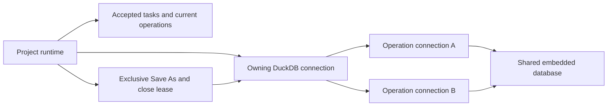

# Native Project Runtime

`backend` embeds DuckDB in the same process as Axum. Tauri and the standalone
binary share this implementation. The retired [Python runtime](../../../archive/docs/architecture/backend/overview.md)
and its storage remain under `archive/` for reference.

## Ownership

The host creates a concrete `ProjectRuntime` and passes it to `serve`. It binds
one project once and retires on close. Save As changes its backing path, not its
runtime. `project.rs` owns database operations, `project/lifecycle.rs` owns files and
checkpoints, and `project/runtime.rs` owns connection leases, active operations,
interruption and retained close completion. `tasks.rs` owns typed task submission
and in-memory summaries. `project/cell_edit.rs` owns transient table editing.
Query, sample and LDaCA modules remain separate.

Each operation clones the owning DuckDB connection into a blocking worker.
Clones share the embedded database instance and explicitly select
`data` using a session setting. The owning connection configures shared
settings, including disabling view dependency enforcement, once at open. Ordinary reads and writes
share lifecycle leases and overlap. DuckDB owns isolation and conflict detection;
Wordflow never retries or replays a conflicting mutation. There is no connection
pool, global write queue or application-wide execution limit.

The owner mutex covers only connection creation and lifecycle state. Save As
takes an exclusive lifecycle lease after existing database operations finish,
checkpoints and replaces the backing file, then allows fresh connections.
Preparatory network and model-loading stages do not hold a database lease; their
next database stage uses the runtime at its current backing path. Frequency
counting holds its operation connection and permissions through a read-only
source snapshot, computation and a separate short atomic publication transaction,
as described in
[native analyses](native-analyses.md).

Operation connections, leases and completion tracking remain owned through cleanup,
even if an HTTP caller disconnects. DuckDB and Arrow encoding run off Tokio workers.
Output spools to temporary files, commits, then streams to the client; disconnect
cleans up completed output. Streaming Arrow execution uses fallible batch fetching,
drains output beyond display limits and rolls back late errors. Cancellation is
checked between batches. There is no retained page cache.

A `CloseAttempt` takes ownership of admission while the host prompts. Accepted tasks
can continue their stages until interruption is requested. Dropping a provisional
attempt after cancellation, failure or abandonment restores admission automatically;
it does not restart cancelled work. Confirmed shutdown retains ownership and its
completion outcome. Interruption cancels network work and each operation's own
DuckDB handle until accepted work settles. Close retires the runtime; all callers await
its retained cleanup result even if the initiating request disconnects. Backend
shutdown interrupts and awaits cleanup and Axum draining without a deadline or
server-task abort. Task status and cancellation never acquire a database lease.

## Application mutation rules

`project/mutations.rs` owns explicit column changes and registered View creation.
The client supplies the operation or SELECT plus column mappings; it does not
construct metadata-maintenance SQL. `project/metadata.rs` applies clone, rename,
delete, type-change and mapped-column policies inside the same transaction as the
owning database mutation. Cast type expressions use the shared DuckDB parser;
Find supplies the same expression used by its preview. Table changes remain
native writes, while View changes reuse query wrappers and existing Undo.

Automatic imports, clones, stopword creation and View copies use one object-name
allocator inside their creation transaction. It checks schema-qualified catalogue
objects, reserved batch names and (for registered results) existing registrations,
including registrations whose objects are missing. It uses DuckDB's ASCII name
matching and the existing numeric suffix convention. DuckDB still owns concurrent
conflicts; there is no frontend preflight, retry or automatic renaming of explicit
user-selected output names.

Stopword membership policy belongs to `project/stopwords.rs`; see
[native analyses](native-analyses.md#frequency-projections-and-export).
These concrete operations preserve the normal runtime write permission and
commit-notification boundary. Arbitrary console SQL remains responsible for its
own metadata and uses broad refresh, without statement-effect inference.

## Native task ownership

`ProjectRuntime::submit_task(label, |context| async move { ... })` returns a
`TaskHandle<T>` whose `wait()` returns the typed result. Accepted work is runtime
owned. Dropping its receiver does not cancel it. A task context supplies progress,
a cancellation token and `run_blocking` for cooperative synchronous work.
Database calls awaited inside the submitted future inherit its task scope and
register connection-specific interrupt handles. Callers must not detach work with
raw `tokio::spawn` or bypass the context's blocking ownership.

Tokio `TaskTracker` retains execution ownership; `CancellationToken` signals
cancellation; a `watch` channel holds the latest snapshot. Explicit admission
checks supplement the tracker, whose `close()` alone does not reject work.
Pausing admission for a native Close prompt blocks new tasks; stages of an
already accepted task may continue until interruption is approved.
Cancellation marks Cancelling until cleanup finishes. Successful committed work
stays successful if cancellation arrives too late. Panics become structured
worker failures. Blocking work must cooperate; it is never force-aborted.

All active tasks and the latest 100 finished summaries stay in memory, separate
from typed results. History survives webview reload and Save As and is cleared
on runtime close. The [task API](../../reference/native-project-api.md#tasks)
provides bounded latest-state delivery without a replay log or polling.
Local, sample and LDaCA imports, Default-mode console execution, Materialize and
Clone submit one task per invocation. Import tasks own catalogue lookup, downloads,
conversion and the final database commit; conversion uses the context's tracked
blocking worker. LDaCA Parquet staging also completes before acquiring database
permission; import rechecks the write boundary afterward. Existing HTTP requests await their typed results and identify
accepted tasks in response headers. Progress reports stages without guessing a
percentage. Automatic reads, previews, persistence bookkeeping and other edits remain ordinary operations.
Data/project HTTP exports own a task through staging; native exports own one task through
destination-adjacent staging, database export, sync and final installation.
[Native exports](native-exports.md) defines shared inspection, snapshot and portable project behavior.
Frequency submits one task per analysis tab run. Task ownership rejects a second
active run on that tab without a separate persisted status flag; other tabs may
overlap. Its publication commit refreshes saved analysis tabs without invalidating graph data. [Native analyses](native-analyses.md) describes result
ownership independently of task retention. The collection imposes no blanket
sequential limit.

## Commit notifications and refresh

`project/changes.rs` owns transient database change scopes. Every application
mutation commits through `PendingChange`; only a successful commit publishes.
Known operations identify schema-qualified objects and affected metadata resources.
SQL console Execute defaults to a broad scope. Read/Preview SQL and exports publish
nothing. Parameterized application SQL explicitly supplies its scope; no attempt
is made to infer arbitrary SQL writes.

For object mutations, the existing catalogue and View-reference inspector runs
before and after the change in its transaction. The union includes direct and
transitive SQL dependants, renamed/deleted sources, and Views whose inspection is
uncertain or unavailable. Table functions are conservative because macros can
hide references. Inspection failure falls back to broad invalidation. Virtual
links do not propagate refresh. Inspection never executes Views or scans data.

The runtime owns one bounded broadcast channel, independent of task completion.
Save As preserves that channel when replacing its database, so existing event
subscribers continue receiving subsequent commits.
`/api/project/events` multiplexes committed `change` events and task snapshots.
Connection/reconnection and channel overflow emit `reset`, covering missed commits
without persisted sequence numbers or history. Accepted work publishes even when
its HTTP caller disconnects. The frontend's window observer cancels affected old
reads, refreshes schemas before their consumers and marks inactive queries stale.
Each live query declares its object dependencies. Saved analysis provenance is
not a live dependency; stopword projections are. No mutation callback triggers a
second refresh. Task summaries still own progress, cancellation and failure
notifications, independently of cache refresh.

## Transactions and Files

Each SQL request owns one transaction. Batch entries contain one complete
statement apiece, with independent positional parameters. Transaction control,
prepared SQL execution, and shared-instance configuration remain restricted.
Explicit session settings, SQL variables and USE are request-local because
operation connections are discarded after the request. Explicit BEGIN and COMMIT
preserve the access mode and statement-indexed errors. On failure or panic, dropping
the disposable connection rolls back before lifecycle/editor permissions and completion
ownership are released. There is no custom transaction-active flag. The editor's
long-lived snapshot retains explicit cleanup; page reads register its interrupt handle
locally, while accepted Save retains the whole editor through completion. Application helpers keep DDL and their metadata mutations in the same
transaction. There is no mutation heuristic, runtime modified flag,
per-mutation metadata update or shared timestamp write conflict. Named projects
need no destination after subsequent commits; every Untitled close prompts.
The filesystem owns modification dates; the project stores creation time only.

Create builds a complete database in a private sibling staging directory, closes
it, and publishes by a same-filesystem hard link that refuses replacement. Open
requires an existing regular file, checks the Wordflow header and metadata
columns through a read-only connection, and then acquires a writable connection.
There is no format migration or initialization of unrelated databases.

DuckDB owns locking, WAL recovery, checkpointing, and temporary files. The
application never deletes a recovery WAL. Normal successful operations persist
directly; Untitled Save preserves the temporary database at a permanent destination.
Tauri coordinates Open and Save As using the document registry opening gate.
The file layer holds a DuckDB-compatible OS lock on an existing destination through
replacement, rejecting another process owner. Closed-file Replace approval remains
effective; failed replacement does not retire the source runtime.

## Editing Ownership

An editor clones the existing DuckDB connection to share its database instance,
starts a read transaction and counts the stored table in that snapshot before
returning the session. Its fixed row count supplies exact editor pagination bounds.
The runtime editor collection owns each reader and bounded recent Save/Cancel
completions. Table-scoped permissions in `project/protection.rs` reserve the
identity before waiting for earlier writes to that Table. Later conflicting
mutations fail with the protected target identified. Normal writes remain
concurrent; DuckDB owns their transaction conflicts. Reads, unrelated mutations,
imports and independent analyses remain available. Arbitrary SQL takes read-only
permission while any editor is reserved or active.

The editor collection serializes session reads and accepted Save/Cancel with
teardown. Independent Tables may retain independent sessions. An idle editor has
no active-task guard. Save As remains excluded while any reader is retained.
Close waits for accepted Save, then releases all remaining sessions.

Page queries use original values and a deterministic native row-reference tie
breaker. When an explicit `rowid` column shadows DuckDB's physical row ID, startup
validates unique, non-NULL supported scalar values. Canonical text references are
matched using the actual DuckDB type, never converted through a generic integer.
Existing identifiers are read-only; inserted identifiers are mandatory and final
uniqueness is checked inside the Save transaction. No persistent row identity or
editing copy is created.

Save validates references against the snapshot before any updates, then deletes,
updates and inserts in one transaction. Indexed updates can move physical row
IDs. Failure rolls back without losing the session or draft. Recent successful
completions remain retryable across independent sessions and Save As.

`changes::Notifications` updates transient mutation stamps synchronously at the
commit boundary before emitting UI events. Broad SQL advances the broad stamp;
known object changes advance affected-object stamps. Editor preconditions are
checked after protection is acquired. Stamps are runtime-local editing guards,
not saved-result freshness or persisted source versions.

## Query Manipulation

[Project operations](../../reference/native-project-api.md) read canonical view
DDL from `duckdb_views()`. A small header lexer preserves explicit column aliases
when extracting its SELECT. DuckDB's SQL/JSON functions parse and render query
bodies; a scoped visitor distinguishes relation bindings, column qualifiers,
correlated queries, and CTE names. JSON is transient, not a project file format.

App-driven column renames adapt dependent View inputs with compatibility
projections while retaining their output interfaces. Recognized rename wrappers
follow the same reconciliation on Undo/Redo. Known execution-request references
are rebased without touching unknown JSON or literals. Saved Plots retain only
captured field bindings, not duplicate execution requests. Structured rename
events update matching window-local drafts without replacing subsequent edits.

The same query inspection classifies logical graph edges. No DuckDB object OIDs,
duplicate view definitions, Polars plans, or general transformation language are
persisted. View dependency enforcement is disabled so the selected view can be
redefined independently; downstream query failures remain visible.

## Remote sample scans

The sample adapter owns GitHub catalogue requests and revision resolution; the
project worker owns transactional remote-view creation. DuckDB autoinstalls and
autoloads its official, signature-verified `httpfs` extension on the first remote
scan. Its normal per-user extension cache is outside the project. Startup and
local imports do not require the extension or network access. Subsequent
connections autoload the cached extension as needed. First use requires internet
access and a writable extension cache.

The hardened macOS release uses the library-validation entitlement to permit
loading the separately signed official `httpfs` extension. DuckDB extension
signature verification stays enabled. Application signing, notarization and
updater signing remain required. A successful development scan does not validate
the signed artifact; release validation must perform an HTTPS Parquet scan.
