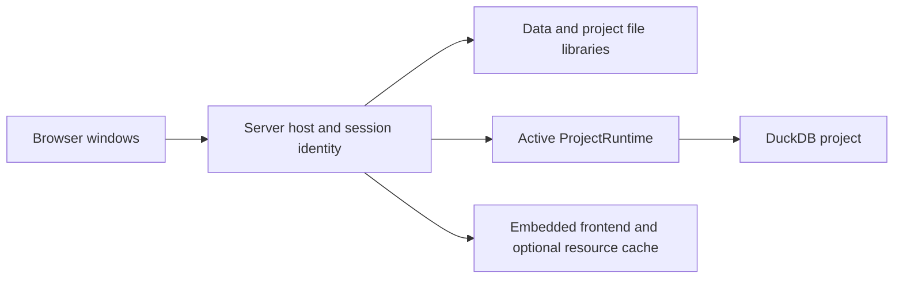

# Standalone server ownership

`server/` owns the `wordflow-server` executable. It embeds the production frontend
and composes the shared backend router with server-only file and project APIs.
Tauri continues to use `wordflow-backend` directly. `wordflow-api-dev` in
`backend/src/bin/` is the API-only Vite/test host and is not a release package.

The host starts one Untitled project. New/Open prepares a fresh runtime before
closing the old one. It never reopens a permanently closed runtime. Editor
protection, Untitled Save/Discard/Stay, task cancellation and failed-operation
retention apply to replacement. Accepted transitions finish even if their HTTP
caller disconnects. Closing the host waits for runtime cleanup.

Each opened runtime receives a random, transient session UUID. Browser project
requests are scoped under `/session/{id}`; the host rejects stale IDs before
forwarding to the shared router. A late request can only refer to the captured
old runtime, whose closing barrier rejects new work. Host SSE announces the
current ID on connection and after changes. Browser windows reconcile the same
active project, cancel obsolete queries and discard project-local drafts.
Refresh/disconnection never closes a project or cancels accepted analysis tasks.

## Storage

`--data-dir` overrides `DATA_DIR`. The default is server-specific application
storage: macOS `~/Library/Application Support/Wordflow/server`, Windows
`%LOCALAPPDATA%/Wordflow/server`, Linux `$XDG_DATA_HOME/wordflow/server` or
`~/.local/share/wordflow/server`.

- `data/`: independent uploaded originals. Uploading does not import. Graph drops
  upload then import through native copy-on-import. Failed imports retain the
  upload; deleting it does not remove copied Data Blocks.
- `projects/`: named `.wfpj` projects. Save As requires an unused name and switches
  to the saved copy. Named projects retain immediate commits.

Safe host connection metadata and the model-aware embedding cache also live
beneath the configured root; credential values remain in the existing host
credential service. Models are downloaded only on demand.

Uploads stream into temporary files in their destination filesystem, then use
atomic no-overwrite publication. Duplicate uploads receive numeric suffixes.
Projects pass read-only format/layout validation first. File APIs accept one
validated filename, reject directory components and symlinks, and cannot delete
the active project. This is single-user filesystem management, not a sandbox
for arbitrary SQL. There are no accounts or multi-user isolation in this release.

Project download uses a checkpointed copy without materializing Views, changing
the active identity or removing saved analyses. It differs from portable Export,
which retains its existing dependency inspection and materialization choices.

## Prefix and contract boundaries

The external public path is deployment configuration, injected into `index.html`
as a base element and JSON. The browser uses it for assets, API, Arrow, SSE and
downloads. A reverse proxy strips that prefix before forwarding. Exact public
Origins are explicitly allowlisted; forwarded headers never grant access.
Jupyter's [prefix-stripping behavior](https://jupyter-server-proxy.readthedocs.io/en/latest/server-process.html#absolute-url)
is the supported proxy model.

Rust handlers own the additional OpenAPI contracts. `pnpm api:generate` invokes
the server exporter, which composes backend and host schemas without opening
storage or loading frontend/model assets. The frontend consumes generated types.

See [server operation and verification](../../runbooks/native-server.md) for
builds, release archives and Binder prerequisites.
