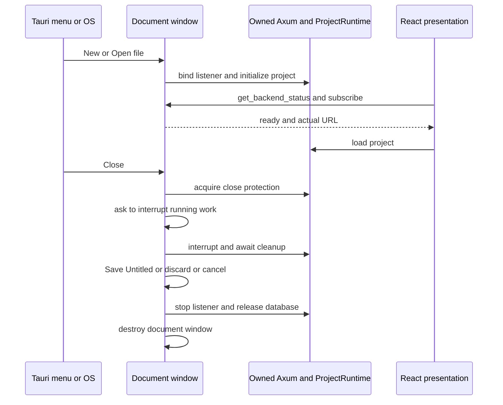
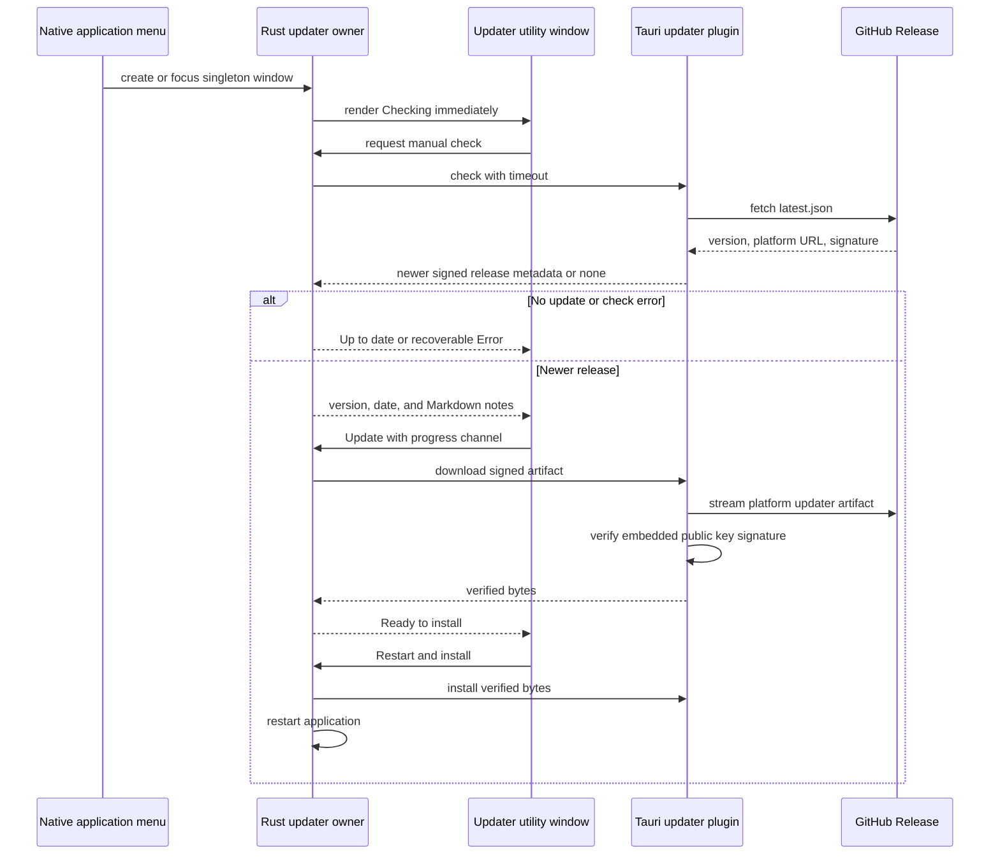

# Desktop Architecture

Tauri hosts the native Axum library from `backend` inside its own process.
The React entrypoint always loads the project interface in both Tauri and the
browser preview. The retired server router and its authentication, Workspace,
Data Root and User File providers are not startup dependencies. Both hosts reuse the original
VS Code titlebar, sidebar, graph cards and controls, and paginated Data View.

## Runtime Contract

A Tauri document-window registry owns one supervisor and `ProjectRuntime` per
window, each with its own ephemeral listener and server task. Window labels are
transient handles. The process shares Tokio, its native menu and updater.
Canonical file paths deduplicate Open requests. New creates another Untitled
window; Save As retains the window, backend URL and interaction state.

The supervisor publishes starting, ready, failed, stopping and stopped to its
own window. React trusts the initial IPC snapshot and targeted status events;
it does not probe HTTP readiness again. The standalone browser preview retains
its HTTP readiness check. A transient failure preserves
an already-mounted interface and reports through Sonner. Closing during startup
prevents late readiness publication. Reload affects only its webview.

All project notifications (`backend-status`, `project-error`, and
`project-changed`) use `emit_to` with the owning window's label. Tauri's `emit`
broadcasts even when called on a window. Another project's startup, failure,
save, or shutdown must not change this window's connection, state, or toasts.

Tauri owns asynchronous parented file choosers and save/interruption prompts,
including during webview reload. Close, Quit and updater restart use the same
coordinator. A scoped close attempt holds backend admission through interruption,
Untitled prompts, saving and final shutdown. Cancellation, errors and abandoned
provisional attempts release that ownership. The retained close outcome distinguishes
backend completion from successful window destruction, allowing destruction to be
retried after failure. Quit owns a separate coordination guard through sequential
prompts; updater installation keeps that guard until restart approval or failure.
Accepted opens own a scoped pending-open counter guard. The canonical-path mutex
is never held through prompts or shutdown waits. Repeated requests coalesce; Quit processes windows sequentially and
stops on Cancel. AppKit termination uses `macos_quit.rs` to protect documents
before Tao's final termination notification. No shutdown timeout, task abort or
force-exit path exists. Closing the last macOS window keeps the menu and Dock
available. See [project semantics](../../domain/native-projects.md) for saving.

## Native Boundaries

Desktop binds IPv4 loopback only. CORS permits `tauri://localhost` and
`https://tauri.localhost`; debug builds additionally permit the existing
`http://127.0.0.1:3001` Vite origin. The library provides health routes and the
[project API](../../reference/native-project-api.md). The document interface uses this API; the standalone browser entry also checks HTTP readiness.

The shell retains its 35-pixel native titlebar area, traffic lights, drag
region, zoom shortcuts, theme bootstrap, and opaque VS Code themed window backgrounds.
The content panes use the existing opaque theme surfaces. Browser development
uses the same project interface through Vite's proxy. The updater has its own
entrypoint and never mounts a project shell.

## Interface and Document Ownership

The former `features/server/ServerApp` entrypoint is preserved under `archive/frontend/`.
`features/project/DocumentSession` observes the native project and file-change
events. A window-local QueryClient owns database state. Tauri owns document
lifecycle, with no React action queue, polling, switching or Save dialog. Neither desktop module mounts
server project catalogues, data-file management, or analysis providers.

`SidebarView`, `ProjectGraphView`, `CustomNodeView`, and
`ProjectDataTableView` own shared presentation. Retired server wrappers under
`archive/frontend/` document the former workspace hooks. Native `ProjectView`, `ProjectGraph` and
`NativeDataView` supply DuckDB operations without server providers. The selection store owns ordered graph membership; a separate preview store
owns the independent shared Data View preview. Page and sort requests are retained per node. Graph drag positions stay
local across metadata refreshes.

Desktop retains its simple Data Loader and [preprocessing tools](preprocessing.md).
Graph and sidebar add buttons feed the active preprocessing input picker.
Restored analyses use [native execution and project-owned results](../backend/native-analyses.md).
The native Task Centre observes project task
snapshots through TanStack Query and SSE, reusing `TaskRows` presentation. Expansion
is local; progress, labels, elapsed time, Cancel and dismissal derive from native
summaries. Reconnection preserves the current list, and only newly observed failures
produce a toast. HTTP and SSE snapshots share one observation path and establish
the notification baseline once. A reconnect preserves that baseline, reports newly
observed failures and refreshes project data once to cover missed completions.
Committed database changes invalidate affected graph/schema/page queries even
when the initiating panel has unmounted. Task completion and exports do not trigger data refresh. Observed IDs are bounded by retained task history. A separate committed-change stream in the same connection owns scoped database refresh; reconnect resets cover missed changes.
Request errors carrying a task ID leave notification ownership to the observer.
Imports, Default SQL runs, Materialize, Clone and native exports populate the Task Centre.
Import dialogs can close while accepted work continues, leaving cancellation
available in the sidebar. Existing callers still receive results; newly added Data Blocks
leave previews and selection unchanged. History never reopens
previews or restores discarded SQL result tables. Help, tutorials and Feedback remain available. Node
menus support rename, clone, export, delete and SQL-layer Undo. Column controls
produce SQL casts, rename and drop edits. The datetime dialog offers explicit
TIMESTAMP and TIMESTAMPTZ targets. A blank format uses strict DuckDB CAST; an
explicit format uses strptime followed by conversion to the chosen target. Native Redo remains disabled.

Native schema/page endpoints return Arrow with column metadata from the same
read-only transaction. Pages use quoted sorting, LIMIT page_size + 1 and OFFSET.
Inactive page caches are discarded; interaction state remains per node.
Graph loading reads metadata and catalogue column counts only. Cards show
`Columns: N`, with unavailable-object diagnostics. No hover count requests or count
cache exists. Data View uses lookahead pagination. The preview shell remains
mounted during loading and errors. Window-local per-node state retains widths,
pinning and expansion through tab switches and node renames. Column operations
capture their table name and kind before submission, so completion reconciles
that node even when another preview is active. Multi-node deletion runs sequentially
within the selection action, retains failed selections and reports one aggregate error. Supported column edits reconcile sorting before
refetch; schemas refresh before row invalidation after broader mutations. Both Utf8 and Utf8View display as string while
retaining their exact Arrow types. No independent native display name
is stored: shared card labels receive the actual table name. The graph header
contains no project name or rename action. Native naming belongs to the filesystem;
the retired server project manager remains in the archive.

The Data Loader is an in-pane import workspace with Local files, Samples and
LDaCA source tabs. `DataLoaderWorkspace` keeps its source panels mounted so
switching tabs or visiting Preprocessing retains drafts and search results.
The header and source tabs remain visible; each source owns one scrolling body
and, for batch imports, a fixed footer. `ThreeColumnLayout` disables its outer
main-pane scrolling for this surface to avoid nested page scrolling.

Local file selection imports immediately through the existing task-owned import
endpoint, using all columns and the filename as the proposed Data Block name.
There is no staging form or schema preflight. The native chooser supports multiple
files; Rust browser preview retains host-path entry. Successful imports update
device-local recent paths. Recent rows obtain filesystem sizes through the shared
metadata endpoint and use bundled Material Icon Theme icons. Size inspection reads
no file contents and does not acquire database ownership or create a task.

`useProjectFileDrop`, mounted once by the workspace, routes native paths and
recent-file drags to Data Loader or the exposed graph. Both activate Local files
and import immediately. Native hit testing converts the pinned Wry
implementation's macOS screen points (physical pixels on Windows) into CSS
coordinates using current webview size and display scale, including page zoom.
Overlays intercept drops. A leave notification cannot discard an accepted drop
while its coordinate conversion is pending; unmount releases the listener.

Samples fetch their catalogue only when active and retain collection/file
selection and import mode. LDaCA uses the existing Rust ONI search/import adapter;
its token stays in window memory and request bodies. Imports retain their
existing Task Centre ownership and commit-driven refresh. Navigation does
not cancel accepted work, and completion changes neither selection nor preview.

`documents.rs` routes startup arguments, running-instance arguments and macOS
file URLs through the same native opening function. Open creates an independent
window or focuses the canonical path already open. New/Open/Save/Save As/Close
belong to the platform File menu with CmdOrCtrl accelerators. No frontend
acknowledgement or file-action queue is involved. The same opening gate coordinates
Save As destination claims and final export installation. Export rejects every
open project destination, including its own source, without changing document identity. Another owning window or external database process
must close the destination before replacement. Running export dialogs remain
dismissible with Close; the Task Centre owns cancellation through final installation.

On macOS, `recent_projects.rs` records canonical saved `.wfpj` URLs with
`NSDocumentController` on the main thread after successful project startup, Save,
Save As, or an explicit Open that focuses an already-ready project. Untitled
projects, data imports and failed/cancelled operations do not enter this history.
macOS owns persistence, deduplication, limits and the standard Dock recent-document
presentation; closing windows or quitting does not clear it. Dock file selections
use the same Tauri file-URL opening flow. Registration is best-effort and cannot
turn a successful save into a failed save. There is no application history store
or project-format change, and the Dev and production bundle identities have
separate native histories.

## Packaging

Application identity comes from Tauri configuration. `pnpm dev:desktop` adds the
Dev override; local QA bundles and releases use the production configuration.
The existing single-instance plugin separates those identities without a custom
lock. Dev has no update endpoints, file associations or bundled Quick Look
extension. Build profiles (debug/release) remain independent of app identity.
Automated native checks have separate debug and release lanes with opt-in test
instrumentation. Final visual/performance acceptance uses an uninstrumented release
bundle; signed distribution checks exercise the actual packaged app. Commands and
build evidence are described in the [desktop runbook](../../runbooks/desktop-runtime.md#automated-native-tests).
See the [runtime runbook](../../runbooks/desktop-runtime.md#develop-and-build)
for commands and side-by-side testing.

Native automation is opt-in: the Cargo `e2e` feature registers the embedded
WebDriver server and WDIO IPC bridge, while Vite's `e2e` mode injects its client.
The test configuration grants bridge permissions only to project windows and
disables updates without changing application identity. Normal Dev and distributable release
builds include neither the driver nor its client. WebdriverIO owns test-process
startup and cleanup. Both native and browser E2E use WebdriverIO; the browser
configuration independently covers Chrome against the Rust preview.
See [automated native tests](../../runbooks/desktop-runtime.md#automated-native-tests).

Tauri links `wordflow-backend` directly. Development and release builds use the
same native code. Desktop packaging needs stable Rust and frontend tooling;
it does not prepare, stage, bundle, validate, or sign a Python runtime.
Application signing, notarization, native icons, and updater artifact creation
remain owned by the desktop build workflow. See the
[desktop runtime runbook](../../runbooks/desktop-runtime.md).

## Finder Quick Look

The macOS bundle contains `WordflowPreview.appex`, a data-based Quick Look
extension registered for `au.edu.ldaca.wordflow.project`. Finder runs its Swift
provider independently of Tauri, React, and Axum. It reads the selected database
through DuckDB's C API in read-only mode, then releases the connection before
returning self-contained HTML. The extension has no network entitlement and
disables DuckDB external access and automatic extension installation/loading.

Quick Look is a document summary: filename, optional description, filesystem size
and modification time, visible Data Block counts by kind, unavailable objects and
saved SQL-cell count. Visible Data Blocks appear in their saved order as compact
rows with identity colours, names, Table/View labels and catalogue column counts.
Native HTML disclosures reveal column names and DuckDB types in schema order.
The preview never loads data values, executes Views, parses SQL references or reads
virtual edge rows. Hidden and unregistered objects and private analysis artifacts
are not listed. Validation matches the native runtime's schema version 1 and required table
layout. Legacy format headers, unsupported versions and malformed layouts are
rejected read-only. Nodes use deterministic name ordering; private output is excluded.

Missing registered objects remain visible as unavailable. Locked, unsupported and
unreadable projects retain available filesystem details with an explanatory message,
without fabricated content counts. Filesystem dates are presentation information,
not application modification tracking. Previewing never changes the project file
or creates an application cache or recovery record.

JavaScriptCore renders static HTML using the bundled TypeScript renderer, without
Dagre or a layout shim. The returned document contains no scripts or external
resources and follows system light/dark appearance. The extension owns a pinned,
checksum-verified DuckDB library matching the backend engine; packaging tests enforce
that relationship. Only macOS bundling invokes its Xcode build. See the
[runtime runbook](../../runbooks/desktop-runtime.md#finder-quick-look) for testing.

## Application Updates

The official Tauri updater is the only application-update path. Rust owns the
signed update resource and the complete check, download, install, and restart
lifecycle. The native application menu exposes **Check for Updates…** as the
manual entry point and opens or focuses one `updater` utility window. A separate
Vite entry renders that window without mounting the backend bootstrap,
authentication, router, or project interface. The updater webview receives only
`core:default`; JavaScript cannot call the Updater, Store, opener, or process
plugins directly. Typed Rust commands expose only the updater operations and
validated HTTPS release-note links it needs.

An empty configured updater endpoint list makes updates unavailable. Rust skips
automatic checks, disables the menu entry, rejects updater commands and returns
no update preferences; Settings displays that updates are disabled. This derives
from the merged configuration rather than debug assertions, so packaged Dev
builds remain isolated and production-identity debug bundles can test updating.

Automatic checks are enabled by default and occur at most once per 24 hours.
Rust persists `automaticChecks`, `lastCheckAt`, and `skippedVersion` in the
device-local Tauri Store. Automatic checks remain silent when no update is
available, fail without interrupting startup, and suppress only the exact
skipped version. Manual checks bypass both cadence and skip suppression. The
desktop-only General setting changes automatic checking; browser deployments
render no setting and make no updater request.

The verified artifact remains in Rust memory between download and installation;
there is no intermediate file controlled by the webview. Closing the updater
window is equivalent to **Decide later** and clears the staged update, except
that close is prevented during download and installation. Each project window owns its own backend close sequence.

The updater public key and endpoint are compiled into Tauri configuration.
The private updater key exists only as GitHub Actions secrets. GitHub Releases
retain installers and updater packages with stable platform filenames; neither the FastAPI
backend nor a Workspace stores application versions. Release tags and assets
are treated as immutable after publication.

Project-window close and application Quit share the asynchronous backend drain
described above. The updater window never owns backend lifecycle.

Desktop project query and mutation failures are reported once through the
project QueryClient's cache callbacks into Sonner. Errors do not occupy space
above the project panes or repeat inside import forms. Notifications remain
until dismissed and offer a bounded, scrollable **Show details** disclosure.
The toast host accepts pointer events while an import modal is open.

On macOS, File > New Project, Open, Save, and Save As dispatch retained document
requests with Command-N, Command-O, Command-S, and Command-Shift-S. They use the
native window coordinator. Open creates another window; closing any Untitled
window prompts Save / Don't Save / Cancel, even if untouched. Named projects
commit immediately and need no close-time save prompt. Save publishes Untitled
via the native save dialog; browser preview has no duplicate file controls. The settings cog opens device-local theme
and update preferences without mounting server authentication or workspace state.

## Table and View actions

Column edits on physical Tables issue ALTER TABLE through the command SQL batch
endpoint, with metadata changes in the same transaction. Views use query-layer
edits and retain SQL-only Undo. Node menus offer Materialize for Views; success
refreshes graph/schema/page queries while preserving selection and positions.
The action stores current values under the same name and ends query-layer Undo.

## Paginated cell editing

The graph and sidebar share **More → Edit Table** for physical Tables. The
large in-project dialog renders the existing `ProjectTable`; its optional cell
renderer is applied at the table-cell boundary so changing a value preserves
input focus. `features/table-editing` owns the headless editing controller,
lossless Arrow page decoding, and embeddable `EditableTable`. Callers can restrict
editable columns and provide custom controls without depending on the dialog.
`ProjectTable` also accepts stable row keys and an optional sticky row-action
column. The editor supplies Delete and Add above buttons; column-restricted
callers omit row actions by default and may enable them explicitly.
Annotation execution remains disabled.

TanStack Query owns the active snapshot page with no inactive-page retention.
The controller owns changed-cell patches, deleted snapshot references and new
row drafts anchored to snapshot rows across pages. It does not retain whole
pages. Display formatting
never supplies editable values: Arrow carries canonical scalar text beside the
original typed fields. Save and Cancel have one notification owner through the
project mutation cache. Failed Save retains the mounted editor and its drafts.

Close, Quit, File Save, Save As and Reload return focus to an open editor through
the window-targeted `focus-table-editor` event. Close checks editing after pausing
admission and before interruption or document Save prompts; refusing to close
resumes normal use. There is no acknowledgement queue or polling. The frontend
releases its session on page hide/unmount; Tauri also releases the reader on
webview navigation/destruction. Cleanup includes pending session startup, and
accepted Save work remains owned until completion. Generic SQL automatically
uses read-only permission during editor protection; source/schema/page previews
remain available. Console source persistence still must succeed before execution.

## Transient interaction ownership

Graph menus use Radix collision handling against the graph container. A node owns
one active Rename/Delete/Export dialog, while menu-open, hover, focus and copy
feedback remain independent. Resize separators own pointer capture and local
listeners; release, cancellation and lost capture finish the interaction. Help
requests use AbortController so replaced/unmounted documents stop downloads and
fallback attempts. Genuine remote failures still use the bundled fallback.

### Optional native resources

Desktop and server ship the application UI and required executable libraries.
Optional assets are downloaded only when used and cached outside project files.
Startup does not fetch ICU, language detection assets or analysis models.

The host supplies cache directories. Timezone operations resolve ICU using the
running DuckDB version and platform, download its official signed extension and
validate it with DuckDB before atomically publishing the cache entry. Later
operations reuse the cache, including offline. Signature validation stays enabled;
failed downloads leave no usable entry and can be retried. An explicit server
`WORDFLOW_ICU_PATH` override remains available for managed offline installations.

Language detection downloads the pinned model and MediaPipe runtime files with
SHA-256 verification. The native HTTP host serves only the allowlisted assets;
no document text is sent to their download origins. Desktop's script policy permits
the local backend to serve verified runtime JavaScript, without trusting remote
CDNs as executable script origins. The detector and model still execute locally.

Topic Modelling shares the native runtime and ONNX model loader with the browser
host; no worker process or topic service is started. The desktop supervisor
supplies `app_cache_dir()/embeddings.duckdb`, keeping the model-aware embedding
cache outside project files and scoped to the application identity. Curated
sentence-transformer assets download on demand; document text stays local.
Preview stream teardown uses native operation ownership, so Close can cancel an
active fit and await its non-interruptible stage, but a completed idle Preview
does not block Close. Release verification must include an actual local model fit,
not merely successful packaging or an instrumented WebdriverIO launch.

### E2E webview storage

Only the `e2e` feature creates a test-owned profile at process startup. All project
windows share that run's profile. macOS uses a fresh WKWebView data-store UUID;
other platforms use a temporary webview directory. Provider configuration uses
the same test-owned temporary root. The application identity remains production.
The automated runner owns the profile directory and UUID. After the driver exits,
it removes only that UUID through a hidden cleanup invocation of the same test binary,
then removes the temporary directory. WebKit can reject removal while the original
app process retains the store, even after its windows close. Production preferences
and Recent files are never cleared. Killing the runner itself or an OS crash can
leave test-owned storage behind. Dock recent documents are macOS-owned and are
not isolated by webview profiles; test them in a dedicated OS account or VM.
