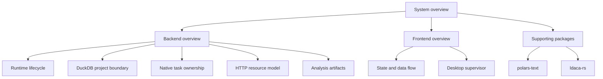

# Architecture

The active runtime is Rust/Axum with DuckDB. FastAPI and Polars plan-storage
reference material lives in the [architecture archive](../../archive/README.md).

Architecture documentation narrows from system topology to one ownership or
flow question per focused page.

- [System overview](system-overview.md) describes the monorepo and end-to-end
  runtime.
- [Native lifecycle reference](../reference/native-backend.md) describes the
  embedded desktop runtime and Rust server.
- [Native project runtime](backend/native-projects.md) describes DuckDB ownership,
  transactions, and catalogue-based query manipulation.
- [Native analyses](backend/native-analyses.md) describes Frequency tasks,
  transactional result publication and private table/BLOB artifacts.
- [Backend overview](backend/overview.md) describes the native runtime, project
  operations and host boundaries.
- [Frontend overview](frontend/overview.md) covers the React application,
  state ownership, and desktop shell.
- [polars-text](packages/polars-text.md) and
  [ldaca-rs](packages/ldaca-rs.md) describe the compiled
  supporting packages.

Architecture pages state current ownership and dependency direction. Product
meaning belongs in `docs/domain/`; operational commands belong in
`docs/runbooks/`; exact interfaces belong in `docs/reference/`.
