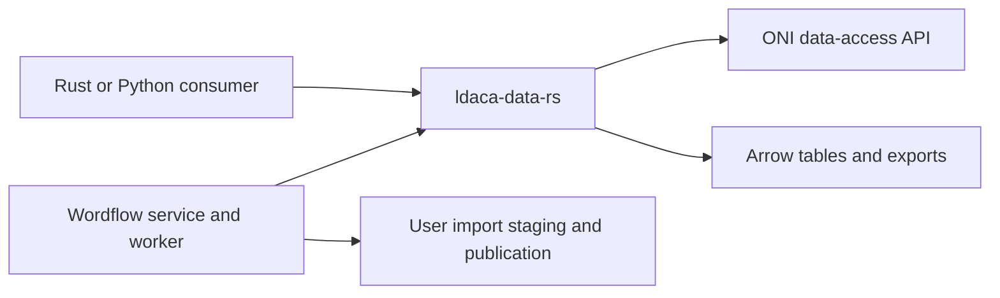

# LDaCA data SDK

`ldaca-data-rs` is an independent Rust library with thin synchronous/asynchronous
Python interfaces. It owns ONI data access, RO-Crate graph interpretation,
configuration discovery, tabulation, document conversion, and Arrow-backed
Parquet/CSV/IPC export. It does not depend on pandas, Polars, SQLite or PyArrow.

Wordflow provides explicit credentials, endpoint/timeout limits and import-owned
paths. It retains request/session handling, settings, quotas, job supervision,
storage naming and atomic publication. Its `wordflow_v1` SDK calls preserve the
existing text-first imports, selected metadata table and old flattening layout.
The generic SDK exposes explicitly selected entity types and retains wide
relationships in companion tables instead of omitting them.

The API key belongs to an immutable client view; connection pools can be shared
without changing another request's credentials. Clients are created inside their
calling process. The backend uses `AsyncClient` for interactive reads and `Client`
inside supervised import workers. SDK exceptions are translated at the service
boundary. Saved Parquet data and the HTTP API contract are unchanged.

See the [SDK README](../../../ldaca-data-rs/README.md) for its public interface,
conversion rules and package commands, and the
[desktop runtime runbook](../../runbooks/desktop-runtime.md) for packaging.

Wordflow names new import folders and Parquet files from the requested name or
collection metadata title. Names preserve Unicode and spaces while replacing
nonportable path characters. Existing imported files are not renamed. Existing
destination conflicts remain explicit errors and never overwrite user files.
