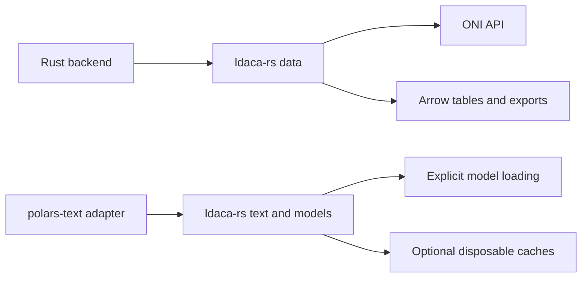

# LDaCA native library

`ldaca-rs/` is a root-tracked Rust library owning reusable text computation and
ONI data access/RO-Crate conversion. It has no Python or Polars dependency.

The core returns ordinary Rust values for text operations and Arrow tables for
imports. Text/model features and the data feature are independent. Persistent
cache entrypoints require `cache`; ordinary tokenization and embeddings do not.

The library owns cleaning/counting, tokenization, tokenizer metadata, concordance,
frequency statistics, embeddings, topic computation/projections and quotation
extraction. The Polars adapter owns Series conversion, lazy plugin registration,
Python argument validation and output schemas. Model and algorithm code has one
implementation in the core, including the formerly Python frequency statistics.

The native backend depends only on `data`. It continues to own project naming,
operation supervision, import publication and error translation. The SDK retains
bounded I/O, immutable credential views, ordered RO-Crate conversion, explicit
Wordflow import profiles, and Arrow exports. No blocking runtime-owning client or
Python SDK bindings remain. The old FastAPI LDaCA integration is outside this
cutover's compatibility boundary.

No DuckDB text-function registration, desktop analysis execution, project schema
change, CI migration or publication is included. See the [library README](../../../ldaca-rs/README.md)
for interfaces, features, offset contracts and local checks.
