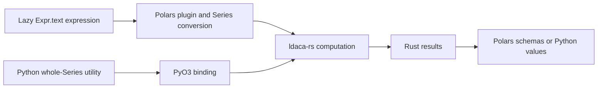

# polars-text Architecture

`polars-text` is the Polars/PyO3 adapter for the sibling
[ldaca-rs library](ldaca-rs.md). It requires that sibling folder for local builds.

Python preserves its typed namespace and public call signatures. Rust adapter
code registers plugin symbols, preserves row/null semantics, translates errors,
and constructs the declared Series schemas. It does not own algorithms, model
loading implementations, caches, UDPipe sources, or tokenizer catalogue entries.
Those are owned by `ldaca-rs` and selected through forwarded Cargo features.

Topic modelling remains a scalar whole-column expression with independent
`documents[]`, `topics[]`, metadata, and optional projection context. Direct
projectors return Python structures without re-running model inference. Quotation
preserves source-character offsets and reuses a core extractor per adapter thread.

The adapter retains Polars allocation, list/struct builders, lazy execution, and
binary licence notices. No Python list materialization is required for token
frequency counting. Retired serialized Polars-plan rewriting remains available
in repository history and is not used by the native project format.

See the [API reference](../../reference/polars-text-api.md) for output contracts
and [development runbook](../../runbooks/polars-text-development.md) for checks.
