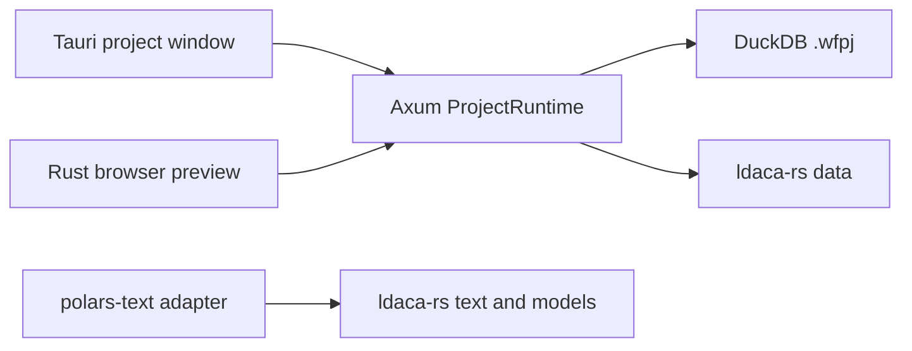

# System overview

Wordflow's active application uses React, Tauri, Axum and DuckDB. Each desktop
window owns an independent embedded backend and project database. The standalone
Rust server supports the browser preview of that native interface.

- `backend/` owns native HTTP, execution and project persistence.
- `frontend/` owns the shared interface, native controller and Tauri host.
- `ldaca-rs/` provides independent text, model and data-access APIs.
- `polars-text/` remains a supported adapter with its own Python tooling.
- [archive/](../../archive/README.md) preserves the retired FastAPI backend,
  Polars plan-storage utilities, Python environment and associated CI/packaging.

The old server components still used by shared frontend presentation remain in
source. Their presence does not make the archived Python backend a maintained
runtime. Legacy engineering pages remain references for future analysis work.

See [native projects](backend/native-projects.md),
[desktop architecture](frontend/desktop.md), and
[package architecture](packages/ldaca-rs.md).
