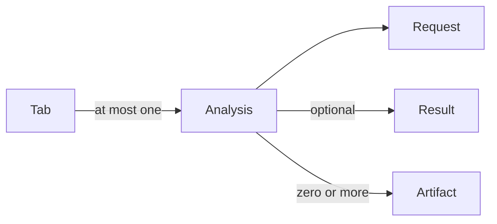

# Native Projects

The Rust backend owns a user-selected `.wfpj` file containing an ordinary
DuckDB database. It is independent of the Python server's managed
[Workspaces](../../archive/docs/domain/workspaces-and-data-blocks.md), User Files, and Data Root. The
native desktop opens an empty Untitled document on direct launch and opens
`.wfpj` documents delivered by the OS. Untitled uses a private temporary DuckDB
file and reports a null public path. Each window owns an independent runtime.
Opening the same canonical path focuses its existing window. All successful
transactions commit immediately, including Untitled. Save on a named project
checkpoints; Save on Untitled chooses a permanent destination. Save As publishes
a checkpointed copy at the chosen path and continues in the same window/backend.
The native chooser's Replace approval authorizes replacement of a closed file.
Another owning Wordflow window or external DuckDB process must close the
destination first. Failed replacement leaves the source project usable.

The application tracks neither modified content nor a dirty flag. The database
stores no modification timestamp. A null permanent path is the only distinction
between Untitled and named projects. Concurrent
operations use independent connections to the same database; DuckDB determines
transaction and catalogue conflicts, which are returned without automatic retries.

Close first prevents new work. If work is running, Tauri asks permission to
interrupt it, then cancels network operations and awaits DuckDB rollback and
cleanup. Every Untitled project then offers Save / Don't Save / Cancel, including
an untouched project. Named projects need no save prompt. Cancelling
or failing Save leaves the window usable. Repeated close requests await one
operation. Quit closes windows sequentially; cancellation stops the remainder.
There is no production shutdown deadline or application-managed force quit.
Closing the last macOS window leaves the application running.

## Data Blocks and Relationships

A registered Data Block is represented internally by a node in `wordflow.nodes`.
Its unique `table_name` identifies its table or view in `data`; there is
no separate node UUID or display name. The graph label is the SQL table/view name. Visibility, color,
and Document Column Preference belong to the registration.
Imports use the selected name or source filename stem, adding `_2`, `_3`, etc.
for repeated sample/LDaCA imports. Local imports use the name entered in the dialog. Unregistered
SQL objects remain queryable and appear in dependency mode, but not in the logical graph.

Tokenizer preferences live in `wordflow.tokenizer_models`, keyed by the pair
`(table_name, column_name)`, with one model per column. Separate columns may use
different models. Keeping the key in two columns avoids ambiguity from dots in
SQL identifiers. SQL changes do not automatically propagate these preferences.

`wordflow.edges` stores virtual relationships between registered Data Blocks,
independently of current SQL. The normal graph combines those rows with direct
View references calculated from the current catalogue, retaining visible endpoints
only. SQL dependencies are solid arrows with filled heads; virtual-only links are
dashed arrows with open heads. A pair with both relationships is drawn once as a
SQL dependency, without deleting its virtual link. Stored edge rows are virtual
relationships; graph inspection never writes or cleans them.

Both projections share schema-aware, scope-aware reference inspection within a
read-only transaction. View queries, including nested queries and CTEs, are inspected
without evaluating rows. Inspection failures remain node diagnostics rather than
proof that no dependency exists. No SQL-dependency graph or layout is persisted.

**Show Dependencies** switches to a separate catalogue projection. It includes all
persistent user-schema Tables and Views, with direct parsed SQL-reference edges,
including hidden raw tables and unregistered SQL objects. Wordflow's metadata schema
and DuckDB system objects are excluded. Materialization removes incoming SQL edges;
registered direct sources become virtual parents in the materialization transaction. Neither projection enables DuckDB dependency
enforcement or persists a dependency history. Broken Views remain inspectable with
missing-reference diagnostics. Dynamic table functions and macros are outside this
static Table/View reference inspection.

Ordinary edits change the current view under its existing SQL name. Descendants
therefore read the changed data and may report query errors after incompatible
schema changes. This deliberately differs from the Python server, where each
Data Block captures an independent Polars plan at creation.

## In-place Edits and Undo

An in-place request supplies a complete SELECT with the sole outer FROM input
`__wf_current`. The backend substitutes the existing query as a subquery, marks
that wrapper with the reserved `__wf_previous` alias, and redefines the view.
View edits add SQL layers without creating stored copies or graph nodes.
Physical Table column casts, renames and deletions use transactional ALTER TABLE
statements. Tables retain their identity and kind; they never acquire a backing
table automatically. Query-layer edit requests reject Tables. Joins and other
new derived outputs are created as Views over their parents.

Undo removes one marked wrapper. The current SQL is the history and survives
close/reopen. There is no Redo, old-version table, or metadata history. Undo does
not reverse source replacement, display changes, deletion, or stored-table
writes. Independent metadata, including Arrow extension annotations, is not restored
or inferred when SQL changes columns. Caller-generated metadata updates remain
explicit SQL operations. Supported casts remove Arrow extension annotations when the
physical type changes, and retain document/tokenizer preferences only for text
or categorical outputs. This cleanup shares the edit transaction. The Data View's
**More SQL types…** dialog accepts DuckDB type expressions, including aliases,
parameters, nested types and existing named types. Suggestions are loaded from
`duckdb_types()` through read-only SQL each time the dialog opens, with duplicate
built-ins collapsed and project-defined names schema-qualified and quoted. The
frontend maintains only a list of common names for the Recommended section;
catalogue pseudo-types `NULL` and `TYPE` are omitted. Suggestions are not an
allowlist, and manual entry remains available if the catalogue cannot load.
Wordflow-generated categorical types (`wordflow.enum_` followed by 32 lowercase
hexadecimal characters) are also hidden from suggestions. This does not drop
the database types. Unused generated ENUMs are not currently reclaimed after
column deletion, recasting or View Undo.
Before mutation, the frontend uses the existing syntax-only
expression parser to validate a single cast of NULL and takes the type from
DuckDB's rendered SQL. Metadata cleanup compares resolved database types, not
user-entered aliases. The ordinary datetime shortcut tries direct conversion,
then bounded format inference, then manual input when needed. See the
[conversion contract](../reference/native-project-api.md).
Parsed offset formats retain a timezone-aware type; successful direct casts are
unchanged. Explicit timezone-aware types remain available in the SQL type dialog.

Source replacement rewrites the selected target view's relation bindings from
one catalogue object to another, using schema-qualified resolution. Virtual links
are independent and remain unchanged. It preserves aliases and does not rewrite
literals or shadowing CTE names. DuckDB prepares a read of the rewritten target
before commit, rejecting recursive definitions and binding errors without
executing the View. Downstream Views are not recreated or validated. A failed
replacement rolls back. This does not create an additional Undo layer.

Materialization evaluates a view into a table and replaces the view under the
same name atomically. It preserves Data Block identity and existing virtual links,
records direct registered sources (including hidden sources) as virtual parents,
cuts upstream SQL dependencies, and ends undo. Unregistered objects are not
registered to record lineage, and plain objects gain no virtual links. Downstream views still read that
name. Hidden raw data is retained for now. Future garbage collection must follow
actual SQL dependencies from visible objects, including references through
clones and hidden Views; virtual links do not establish liveness. There is no
automatic orphan cleanup in this implementation.

## Metadata and Results

[The schema](../../backend/src/schema.sql) defines the integer `schema_version = 1`
contract, independently of the application version. New projects contain `data`
for user Tables and Views, and `wordflow` for application records, private output
relations and generated types. Connections default to `data`; explicitly qualified
objects in other user schemas remain supported. Data Blocks are returned in
case-insensitive name order, with the original name breaking ties.

| Table in `wordflow` | Responsibility |
| --- | --- |
| `project` | Singleton schema version, description and creation time |
| `nodes` | Case-insensitively unique registered name, visibility, color and document column |
| `edges` | Logical source/target relationships; SQL dependencies remain derived |
| `arrow_metadata` | Qualified relation and field-path extension annotations |
| `tokenizer_models` | Per-column model preferences, retained for future defaults but not automatically selected |
| `tabs` | Identity, tool kind, name, position and display settings |
| `analyses` | One submitted request per owning tab, optionally with completed output |
| `artifacts` | Named relation or BLOB outputs owned by one analysis |
| `sql_cells` | Saved SQL source, order and execution mode |

The tab stores neither the request nor an analysis pointer. `analyses.tab_id` is
unique and non-null. An analysis has a UUID, submitted request, creation time and
optional versioned result. Result payload, positive version and completion time
are either all present or all SQL NULL. A non-null zero-match result is valid.
Task state remains exclusively in the runtime; an analysis without output does
not imply running work.

An accepted Run atomically replaces the tab's analysis and all owned output before
model preparation. Failure of admission or this transaction preserves prior state.
Later failure or cancellation retains the newly submitted request without output.
Successful publication fills that exact analysis; it cannot recreate a deleted or
replaced analysis. Clear removes output and artifacts while retaining the analysis
identity and request. Deleting the tab removes the entire ownership chain. Neither
action deletes independently published Data Blocks. Clear is unavailable during
an active Run. The [native analysis architecture](../architecture/backend/native-analyses.md)
owns execution and transaction details.

Unsubmitted edits remain window-local. Preview is temporary for the current tab
visit and is discarded on navigation, reload, Run or Clear. Reopening restores the
submitted request and available output, never interrupted jobs. Frequency,
Concordance and Quotation are restored; other tools remain unavailable.

Result JSON contains output-specific descriptors, artifact references and summaries,
not duplicated generic requests or complete rows. Private Tables and Views retain
exact values and BLOB artifacts retain their bytes. Sources captured in output
descriptors are provenance, not live dependencies. Saved output remains readable
and exportable after source changes or deletion. Frequency stores counts and a
statistics View over those counts; Concordance and Quotation retain matching source
rows needed for inspection and independent publication.

`arrow_metadata` is the single source for explicit Arrow extension annotations.
Its key is `(schema_name, relation_name, field_path)`. Paths are canonical JSON
arrays encoded as text: `["text"]`, `["source","text"]` and `["source.text"]`
are distinct. A shared serializer validates nonempty string arrays. Extension
payloads are nullable opaque strings, including empty or non-JSON values.
Annotations enrich matching nested Arrow fields at node, editor, Preview, saved
query and IPC export boundaries. Physical types remain owned by DuckDB.

Saved relations receive independent annotations on their actual source fields;
match-only artifacts have none. Publication copies applicable annotations into
independently owned Data Blocks. Renames, column deletion and incompatible casts
reconcile annotations transactionally; selected document columns and stopword
references follow application-driven renames. Known column mappings preserve
applicable annotations. Arbitrary SQL performs no rename inference or general
metadata propagation and retains broad refresh behavior.

Local-file and LDaCA imports create a hidden `<name>_raw` Table, a visible
`<name>` View selecting from it in one transaction. Their dependency is calculated
from SQL; imports do not insert an edge row.
Both names are allocated uniquely. Original files are not required afterward.
Hidden is a presentation property, not a SQL write restriction. Materializing
the visible View preserves the raw import and creates independently editable
Table values; other clones may still depend on that raw import.

Sample imports offer individual Parquet files grouped by sample project. By default,
**Import as views** creates registered remote Views. Disabling it materializes
selected files directly as Tables in the project, with no hidden raw copy. Each import
resolves the latest `main` once, reads the catalogue at that commit, and stores
full commit-SHA URLs in the view definitions. Existing views never follow later
branch changes. Selected sample files add Data Blocks to the current document;
repeated imports create independent registrations. Remote views need internet
access after saving or relocating the `.wfpj`. Materialization embeds their current
data for offline use. Credentials, installed models, and
disposable caches do not belong in a project. Table editing uses session-only
row references; no row identity is persisted in the project.

Opening uses read-only preflight before any writable connection. Legacy files
(including files with `format_version = 1`), unsupported schema versions and
malformed layouts are rejected unchanged. No migration or upgrade machinery exists.
The project header has no UUID, stored name or path. Ownership uses centralized
transactions rather than foreign keys; primary keys, uniqueness and shape checks
remain enforced.

## Native object actions

Rename changes the actual object name, registered node key, edges, column
metadata and tokenizer preferences atomically. Parsed relation rewriting updates
dependent view definitions; DuckDB does not rename those references itself. A
failed rename preserves the previous committed state. SQL string literals and
CTE-shadowed names are not rewritten.

Clone creates a unique `_copy` name. A table clone copies stored rows; a view
clone copies the current query definition. Both copy column/node preferences
and copy the original's incoming virtual links once in logical mode. Dependency-mode
Clone copies only the SQL object into the same schema, with no registration,
preferences or edges. They copy no outgoing
edges and add no original-to-clone edge. A view clone follows its copied query's
inputs, not later SQL edits to the original view. Graph relationships are
independent after cloning.

Categorical casts create a DuckDB ENUM from current distinct non-null strings.
Later unseen values require a new cast. Arrow dictionaries retain allowed
values, including unused values, but not the named SQL type or its database
constraint. String dictionaries with unsigned 8-, 16- or 32-bit indices are
labelled categorical without changing their exact Arrow type.

## Table cell editing

**More → Edit Table** opens a paginated editor for a stored Table. Views must
first be materialized. Page navigation and sorting retain changed cells and row edits in
memory; they do not write to the project. Ordering uses the original snapshot
until the editor finishes, so changing a sorted cell does not move its row.
The editor uses the same pagination footer as Data View, with a snapshot row
count enabling first/last page links and the page-jump control.

Each row has Delete and Add above controls. New editable cells start as NULL.
Added rows stay immediately before their original snapshot anchor, including
when that anchor is deleted. Sorting and page changes move the anchor and its
draft rows together. Pages keep their original snapshot boundaries, so drafts
can temporarily change the number of displayed rows on a page. Empty pages
offer Add row. Deleting a newly added row simply removes that draft.
The insertion position is only an editing aid: Save inserts ordinary DuckDB
rows, and subsequent reads use their normal ordering. No row position is stored.

Save commits all changed cells, deletions and insertions atomically and closes the editor. A failed Save
leaves the draft editable for correction and retry. Cancel discards all pages'
edits, with confirmation when changed. Saving table edits in Untitled does not choose a
permanent filename; the existing document Save still does that afterward.

Text, booleans, integers, decimals, floating-point numbers, supported temporal
values and categorical values can be edited. Typing directly into a NULL cell
sets its value; focusing it alone leaves NULL unchanged. NULL and an empty string
remain separate choices through the cell's value/NULL control. Complex types
remain read-only. A real column named `rowid` can identify rows when its supported
scalar values are unique and non-NULL. It is read-only on existing rows; inserted
rows must supply their own valid identifier. Identifiers retain their native type,
so text `01` and `1` remain distinct. Otherwise the editor uses DuckDB's hidden
physical row IDs only for the protected session. Editing
does not add columns, copies, history, or schema changes; SQL-layer Undo does not
reverse these stored-table writes.

Editor protection covers the edited Table's data, schema and identity. Separate
Tables can have independent sessions. Reads, imports into new Tables and saved
analyses remain available. SQL-console execution becomes read-only while any
editor is pending or active. Save As waits until editing ends.

App-driven table and column renames reconcile recognized execution references.
Dependent Views keep their output names, order and aliases. Captured result data
keeps its original schema; saved Plots retain explicit field bindings when live
request columns are renamed. Unknown request JSON and literal query text remain
unchanged. SQL-console renames do not receive automatic reference repair.

## Saved SQL cells

`wordflow.sql_cells` stores a UUID cell identifier, integer ordering position,
SQL source and `default`/`live` execution mode. Cell IDs identify source records,
not projects or Data Blocks. Results and execution history are not persisted.
A new cell stays local until its first execution. Its captured source is then saved
in a separate transaction; subsequent blur and Run save changes. Failed SQL remains
available after reopening, while never-run local drafts do not. Older project formats are rejected
without migration.
The [console architecture](../architecture/frontend/preprocessing.md#sql-console)
owns draft and result lifetimes and the native Close/Reload boundary.

## Native task summaries

Task IDs identify executions only. Queued means accepted but not started;
Running includes resource waits described by progress messages. Cancellation
requests enter Cancelling until rollback and cleanup finish. Terminal states are
Succeeded, Failed and Cancelled. A late cancellation cannot turn committed success
into cancellation.

The runtime retains active tasks and the latest 100 finished summaries through
reload and Save As. Closing it clears this history. Dismissal removes a finished
summary without touching results. Task history contains no results, credentials,
artifacts or persisted execution log. Imports, explicit Default SQL runs,
Materialize, Clone, Frequency and native export each produce one task. Task summaries describe
the operation; database commit notifications own refresh, while exports do not reload project data. Automatic previews and housekeeping
remain outside task history. Frequency tasks identify their owning analysis tab;
one run per tab may be active, while independent tabs and project windows overlap.
Progress and execution state are not persisted with results. Reload reconnects to
runtime-owned work; reopening a project restores completed results but does not
resume interrupted tasks.
